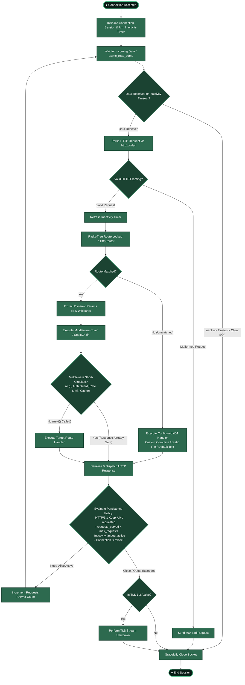

# WaveX

A modern, high-performance C++23 backend framework built for coroutine-native HTTP servers & clients, Express.js-style pipeline execution, extensible protocol support, and powerful CLI tooling.

WaveX draws inspiration from **Rust's Actix Web** (hybrid radix-tree routing), **Tokio** (hybrid work-stealing dual-queue runtime with hysteresis-based thread scaling), and **Express.js** (linear middleware chain with immediate response dispatching).

[](RELEASE_NOTES.md)
[](LICENSE)
[](https://en.cppreference.com/w/cpp/23)
[](https://cmake.org)

---

## Features

- **⚡ Coroutine-Native Engine** — Async server handlers and client requests written with asio C++23 coroutines (`co_await`, `asio::awaitable<void>`), zero callback boilerplate.
- **⚡ Native HTTP/2 (RFC 7540) & HPACK (RFC 7541)** — Full binary framing engine (`http2codec`), connection preface validation (`PRI * HTTP/2.0...`), client/server `SETTINGS` negotiation & ACK handshake, server-side ALPN selection (`h2` over TLS 1.3), stream multiplexing, and HPACK static/dynamic table compression.
- **⚡ 3-Seam Decoupled Server Architecture** — Completely protocol-agnostic `Server<Codec, Router>` template decoupled across three distinct seams: Transport Seam (`AsyncStream` over Plain TCP, TLS 1.3, or future QUIC), Codec Seam (`parse_stream`/`serialize`), and Policy Seam (`wavex::protos::protocol_traits<Codec>`) governing prefaces, keep-alive, response preparation, and ALPN negotiation.
- **⚡ C++23 "Deducing This" Static Pipelines** — Zero-overhead static dispatch mixin (`wavex::Chainable`) enabling compile-time tuple pipelines (`wavex::StaticChain`), `make_chain` factory, and semi-static runtime toggles (`ConditionalChainable`), eliminating vtable and dynamic `std::function` heap allocation overhead.
- **⚡ CRTP Zero-Vtable Architecture** — Static compile-time polymorphism (`Request<Derived>`, `Response<Derived>`) eliminating virtual function pointers (`vptr`), saving memory and enabling zero-overhead direct dispatch.
- **🚀 Express.js-Style Linear Pipeline** — Iterative, non-recursive `run_chain()` middleware runner with immediate response dispatch (`res.send()` / `res.json()`), type-erased write sinks for transport-agnostic streaming (`start_chunked()`, `send_file()`), and short-circuit commitment tracking.
- **🌳 Hybrid Radix-Tree Router** — High-performance radix-tree supporting static segments, dynamic parameters (`:id`), `{id:[0-9]+}` RE2 regex constraints, catch-all wildcards (`*filepath`), and RFC 9110 HTTP methods including `QUERY`.
- **🌐 Dual-Protocol Coroutine HTTP Client** — Asynchronous, coroutine-native client (`HttpClient`) supporting both HTTP/1.1 & HTTP/2 (RFC 7540), plain TCP and TLS 1.3 OpenSSL encryption, ALPN auto-negotiation (`h2`/`http/1.1`), prior-knowledge `h2c`, instant domainless IPv4/IPv6 direct endpoint resolution, framing-aware early response completion (no EOF stalls), structured query parameter builders, and multi-payload posting (plain text, form-urlencoded, raw binary, and JSON).
- **📦 Chunked Transfer-Encoding** — Full streaming support for HTTP/1.1 chunked request and response encoding & decoding.
- **📁 RFC 7578 Multipart/Form-Data & Disk Spooling** — Complete multipart parsing and building (`MultipartFormData`, `UploadedFile`, `FormField`) with automatic in-memory buffering and configurable disk spooling (`TempFileGuard`) above memory thresholds (`max_memory_buffer`).
- **🗜️ Zero-Overhead Payload Compression** — Gzip and Deflate compression and decompression (`Compressor`, `CompressionFormat`) with transparent request decoding (`req.decompressed_body()`), client payload compression (`req.compress()`), and client response decompression (`res.decompressed_body()`).
- **🔀 Fluent Redirection Engine** — Express- & Fastify-compatible redirection (`res.redirect()`, `res.permanent_redirect()`, `res.temporary_redirect()`) with automatic RFC 9110 status code and `Location` header synchronization.
- **🛡️ Request Body Size Limits & 413 Protection** — Configurable payload ceilings on `Server` (`max_request_size`, `max_memory_buffer`) and dedicated middleware (`wavex::base::body_limit`) immediately returning HTTP 413 Payload Too Large on oversized bodies.
- **🗂 MIME Type Detection Engine** — Fast, built-in file extension to MIME content-type resolver (`MimeTypes.hpp`) supporting over 50+ common web media types.
- **🛠 Modern CLI Engine** — High-performance CLI argument parser (`wavex::cli::CliParser`) supporting flags (`--verbose`, `-v`), key-value options (`--host`, `-p`), positional arguments, typed getters (`get_int`, `get_bool`), and automatic `--help` generation.
- **🔒 TLS 1.3 OpenSSL Encryption Engine** — Strict, native TLS 1.3 server encryption (`enable_tls()`, `wavex::server::TlsConfig`) supporting custom PEM certificate chains (`cert_file`), private key passphrases (`key_password`), DH parameters (`dh_file`), ALPN protocol negotiation (`http/1.1`, `h2`), and strict legacy SSL/TLS protocol disabling (`force_tls13`).
- **🔄 HTTP Stay-Active & Inactivity Timeout (RFC 7230 / RFC 9112)** — Full persistent connection support over Plain TCP and TLS 1.3 streams. Handles HTTP pipelining without socket re-establishment, manages inactivity timeouts (`set_keep_alive_timeout`) via asio steady timers, enforces maximum request thresholds (`set_max_keep_alive_requests`), and includes zero-cost compile-time policies (`KeepAlivePolicy`) and middlewares (`keep_alive`, `sse_stay_active`).
- **🚫 Configurable 404 Not Found Engine** — Default `"Not Found"` string response with full customization support across Router and Server: custom text, HTML/JSON bodies with automatic MIME types, static error pages loaded from disk (`not_found_page`), or custom coroutine handlers.
- **🧵 Tokio-Style Work-Stealing Dual-Queue Runtime** —
  - **`InlineTask<64>`**: Zero-heap-allocation type-erased move-only task container with 64-byte SBO aligned to `std::max_align_t`. Eliminates `std::function` dynamic allocation overhead for coroutine continuations and move-only closures.
  - **Lock-Free Worker Table**: Fixed-capacity atomic pointer table (`worker_table_`) eliminating `workers_mutex_` contention on hot dispatch and work-stealing paths.
  - **`LocalQueue` & `InjectorQueue`**: Bounded 256-slot ring buffer per worker thread for ultra-fast LIFO/FIFO work stealing, backed by an unbounded global MPMC queue for overflow and external tasks.
  - **Sub-Millisecond Event Waiting**: Integrated `asio::executor_work_guard` ensures worker threads poll ready work in 0μs and sleep efficiently inside the OS kernel event loop (`run_one_for(100us)` IOCP/epoll) when idle without CPU busy-spin or deadlock.
  - **Proportional Scaling & Burst Triggers**: Dynamic hardware concurrency defaults (`max_workers`, `min_workers`) with hysteresis cooldown and fast-path burst spill triggers.
  - **Zero Request Loss on Scale-Down**: Retiring workers safely drain their remaining local ring tasks back into `InjectorQueue` on thread exit.
- **🛡 Pipeline Short-Circuiting** — Middleware rejection (e.g. `401 Unauthorized`) immediately sends the response while skipping downstream middlewares and route handlers.
- **⚡ Zero-Fragmentation Memory & Contiguous Containers** — Contiguous `FlatMap<K, V, 16>` stores `req.params`, `req.query`, and `res.headers_` directly inside cache-line-aligned inline arrays with zero heap allocations on the hot request path. Memory management is complemented by a three-tier bump allocator (`RequestArena`) backed by a 4KB inline buffer and thread-local slab pools. Socket acceptance configures `TCP_NODELAY` immediately to prevent delayed-ACK penalties, and connection handling utilizes an offset cursor (`stream_buf_consumed`) to amortize buffer compaction.
- **🛑 Production Graceful Shutdown & Generic Pub-Sub Event System** — Clean connection draining with deadline timeouts (`server.exit()`, `server.shutdown()`), automatic `SIGINT`/`SIGTERM` interception, OS signal handler restoration (`SIG_DFL`), proactive keep-alive cancellation, automatic `Connection: close` stamping, worker-thread deadlock immunity, complete server restartability (`server.run()` unblocks without `std::exit`), and a zero-overhead generic C++23 pub-sub event bus (`wavex::base::Event`, `EventBus`, `ShutdownEvent`).
- **🧪 Interactive Postman Dev Servers** — Pre-configured CLI-driven testing servers for HTTP/1.1 ([tests/postman_demo_http1_server.cpp](tests/postman_demo_http1_server.cpp)) and HTTP/2 ([tests/postman_demo_http2_server.cpp](tests/postman_demo_http2_server.cpp)) supporting plain and TLS 1.3 modes via WaveX's built-in CLI parser.

---

## Quick Start

### 1. Minimal "Hello, World!" Server

The absolute simplest WaveX server in under 15 lines of code:

```cpp
#include <wavex/wavex.hpp>

int main() {
    auto &router = wavex::engine::HttpRouter::instance();

    // Plain text "Hello, World!" endpoint
    router.get("/", [](auto &, auto &res) -> asio::awaitable<void> {
        res.status(200).send("Hello, World!");
        co_return;
    });

    // Bind and run server on http://127.0.0.1:8080
    wavex::server::Server server(router, "127.0.0.1", 8080);
    wavex::log::info("WaveX server running on http://127.0.0.1:8080");
    server.run();

    return 0;
}
```

### 2. "Hello, World!" JSON API & Route Parameters

Returning structured JSON and reading dynamic path parameters (`:name`):

```cpp
#include <wavex/wavex.hpp>

int main() {
    auto &router = wavex::engine::HttpRouter::instance();

    // 1. JSON "Hello, World!" endpoint
    router.get("/api/hello", [](auto &, auto &res) -> asio::awaitable<void> {
        res.status(200).json({
            {"message", "Hello, World!"},
            {"framework", "WaveX"},
            {"status", "success"}
        });
        co_return;
    });

    // 2. Dynamic route parameter: /hello/Alice -> "Hello, Alice!"
    router.get("/hello/:name", [](auto &req, auto &res) -> asio::awaitable<void> {
        auto name = req.param("name").value_or("World");
        res.status(200).send("Hello, " + std::string(name) + "!");
        co_return;
    });

    wavex::server::Server server(router, "127.0.0.1", 8080);
    server.run();

    return 0;
}
```

### 3. HTTP/2 Server (Cleartext h2c & TLS 1.3 h2)

WaveX provides native HTTP/2 server support via `Http2Server` and `Http2Router`, implementing RFC 7540 binary framing and RFC 7541 HPACK header compression:

```cpp
#include <wavex/wavex.hpp>

int main() {
    auto &router = wavex::engine::Http2Router::instance();

    // Stream-aware HTTP/2 JSON endpoint
    router.get("/api/h2", [](auto &req, auto &res) -> asio::awaitable<void> {
        res.status(200).json({
            {"protocol", "HTTP/2"},
            {"stream_id", req.stream_id()},
            {"framework", "WaveX"}
        });
        co_return;
    });

    // Option A: Cleartext HTTP/2 (h2c) on port 8082
    wavex::server::Http2Server server(router, "127.0.0.1", 8082);

    // Option B: HTTP/2 over TLS 1.3 (ALPN 'h2' negotiated automatically on port 8444)
    // wavex::server::Http2Server server(router, "127.0.0.1", 8444);
    // server.enable_tls("ssl/test.crt", "ssl/test.key");

    wavex::log::info("WaveX HTTP/2 server running on http://127.0.0.1:8082");
    server.run();

    return 0;
}
```

### 4. Full HTTP Server & Coroutine Middleware

```cpp
#include <iostream>
#include <wavex/wavex.hpp>

using namespace wavex;

// Auth Guard Middleware
asio::awaitable<void> auth_guard(protos::http::HttpRequest &req, protos::http::HttpResponse &res, base::Next next) {
    auto auth_header = req.header("Authorization");
    if (!auth_header || *auth_header != "Bearer secret123") {
        res.status(401).json({{"error", "Unauthorized"}});
        co_return; // Immediate response sent, short-circuits pipeline!
    }
    co_await next();
}

int main() {
    auto &router = engine::HttpRouter::instance();

    // 1. Plain text endpoint
    router.get("/", [](protos::http::HttpRequest &, protos::http::HttpResponse &res) -> asio::awaitable<void> {
        res.status(200).send("Welcome to WaveX!");
        co_return;
    });

    // 2. JSON endpoint
    router.get("/api/json", [](protos::http::HttpRequest &, protos::http::HttpResponse &res) -> asio::awaitable<void> {
        res.status(200).json({{"status", "success"}, {"framework", "WaveX"}, {"version", wx_version}});
        co_return;
    });

    // 3. Protected endpoint with middleware
    router.get("/api/protected", {auth_guard}, [](protos::http::HttpRequest &, protos::http::HttpResponse &res) -> asio::awaitable<void> {
        res.status(200).json({{"secret", "Access Granted"}});
        co_return;
    });

    // 4. Wildcard catch-all endpoint
    router.get("/files/*filepath", [](protos::http::HttpRequest &req, protos::http::HttpResponse &res) -> asio::awaitable<void> {
        res.status(200).json({{"file", std::string(req.path())}});
        co_return;
    });

    server::Server server(router, "127.0.0.1", 8080);
    wavex::log::info("WaveX server running on http://127.0.0.1:8080");
    server.run();

    return 0;
}
```

### 5. Modern Logging with Source Location & ANSI Colors

Zero-macro, high-performance logging with automatic `std::source_location` call-site capture and ANSI terminal colors:

```cpp
#include <wavex/Base/Logger.hpp>

int main() {
    // Configure minimum log level (TRACE, DEBUG, INFO, WARN, ERROR, FATAL)
    wavex::base::Logger::instance().set_level(wavex::base::LogLevel::DEBUG);

    // Enable or disable ANSI terminal colors (enabled by default)
    wavex::base::Logger::instance().set_colored(true);

    // Modern functional logging API
    wavex::log::trace("Buffer allocated: {} bytes", 1024);
    wavex::log::debug("Route match resolved in {} us", 12.4);
    wavex::log::info("Worker pool online: {} threads", 8);
    wavex::log::warn("Slow database query detected ({}ms)", 235);
    wavex::log::error("Connection reset by peer: fd={}", 14);

    // Optional: direct logs to file or custom stream
    // wavex::base::Logger::instance().set_output("./logs/wavex.log");

    return 0;
}
```

### 6. C++23 "Deducing This" Static Pipelines (`class Chainable`)

Build compile-time static dispatch pipelines without vtables or dynamic heap allocations using `StaticChain` and `make_chain`:

```cpp
#include <wavex/Base/Chainable.hpp>
#include <wavex/Engine/HttpRouter.hpp>
#include <iostream>

// 1. Define Chainable Middlewares using C++23 "Deducing This"
struct AuthGuard : public wavex::Chainable {
    template <typename Self, typename Req, typename Res>
    asio::awaitable<bool> handle_impl(this Self&& self, Req& req, Res& res) {
        if (req.header("Authorization") != "Bearer valid_token") {
            res.status(401).send("Unauthorized");
            co_return false; // Short-circuits remaining pipeline statically!
        }
        co_return true; // Proceed to next handler
    }
};

struct AuditLogger : public wavex::Chainable {
    template <typename Self, typename Req, typename Res>
    asio::awaitable<bool> handle_impl(this Self&& self, Req& req, Res& res) {
        std::cout << "[AuditLog] Request path: " << req.path() << "\n";
        co_return true;
    }
};

struct TargetHandler : public wavex::Chainable {
    template <typename Self, typename Req, typename Res>
    asio::awaitable<bool> handle_impl(this Self&& self, Req& req, Res& res) {
        res.status(200).send("Static Chain Success!");
        co_return true;
    }
};

// 2. Register Static Chain directly in HttpRouter
int main() {
    auto &router = wavex::engine::HttpRouter::instance();

    // Fuses Auth -> Audit -> Handler into 1 statically dispatched, inlined pipeline!
    router.get("/api/static-fast", wavex::make_chain(AuthGuard{}, AuditLogger{}, TargetHandler{}));
}
```

### 7. Dual-Protocol Coroutine HTTP Client (HTTP/1.1 & HTTP/2)

WaveX provides a protocol-agnostic, coroutine-native HTTP client (`HttpClient`) supporting ALPN auto-negotiation, cleartext `h2c`, TLS 1.3 `h2`, domainless IPv4/IPv6 endpoints, query parameter builders, and multi-payload posting:

```cpp
#include <iostream>
#include <asio.hpp>
#include <wavex/wavex.hpp>

using namespace wavex::client;

asio::awaitable<void> run_client_examples() {
    // 1. GET with automatic protocol negotiation (ALPN h2 / http/1.1)
    ClientResponse res = co_await HttpClient::get("https://api.github.com/zen");
    std::cout << "Status: " << res.status_code() << "\n";
    std::cout << "Protocol: " << (res.http_version() == HttpVersion::Http2 ? "HTTP/2" : "HTTP/1.1") << "\n";
    std::cout << "Body: " << res.body() << "\n";

    // 2. Structured query parameters & non-JSON plain text POST
    auto search_res = co_await HttpClient::get("http://127.0.0.1:8080/search", {{"q", "wavex"}, {"page", "1"}});

    auto text_res = co_await HttpClient::post("http://127.0.0.1:8080/log", "Worker pool scaled to 8 threads", "text/plain");

    // 3. JSON POST with automatic serialization
    nlohmann::json payload = {{"service", "auth"}, {"status", "healthy"}};
    auto json_res = co_await HttpClient::post("http://127.0.0.1:8080/api/status", payload);

    // 4. Domainless IPv6 Endpoint
    auto ipv6_res = co_await HttpClient::get("http://[::1]:8080/v1/health");

    // 5. High-Performance Direct HTTP/2 (Prior Knowledge h2c)
    ClientOptions h2c_opts{ .version = HttpVersion::Http2 };
    auto rpc_res = co_await HttpClient::get("http://127.0.0.1:8082/rpc/status", h2c_opts);

    // 6. Templated Concrete Response (Backward Compatible)
    wavex::protos::http::Http1Response h1_res = 
        co_await HttpClient::get<wavex::protos::http::Http1Response>("http://127.0.0.1:8080/api");
}
```

### 8. Command-Line Interface (CLI) Engine

```cpp
#include <wavex/Cli/Cli.hpp>
#include <iostream>

int main(int argc, char* argv[]) {
    wavex::cli::CliParser parser("wavex-tool", "WaveX High-Performance HTTP Server Utility");

    parser.add_flag("verbose", 'v', "Enable verbose logging")
          .add_option("host", 'h', "Host address to bind server", "127.0.0.1")
          .add_option("port", 'p', "Server port to listen on", "8080");

    auto result = parser.parse(argc, argv);
    if (!result.ok()) {
        if (result.help_requested) {
            parser.print_help();
            return 0;
        }
        std::cerr << "Error: " << result.error_message << "\n";
        return 1;
    }

    std::string host = parser.get_string("host");
    int port = parser.get_int("port", 8080);
    bool verbose = parser.get_bool("verbose");

    std::cout << "Starting server on http://" << host << ":" << port << " (verbose=" << verbose << ")\n";
    return 0;
}
```

### 9. TLS 1.3 Server Encryption (`TlsConfig`)

Enable strict TLS 1.3 HTTPS server encryption using `server.enable_tls()` with custom certificate/key paths or a `wavex::server::TlsConfig` struct:

```cpp
#include <wavex/wavex.hpp>
#include <wavex/Server/TlsConfig.hpp>

int main() {
    auto &router = wavex::engine::HttpRouter::instance();

    router.get("/secure", [](auto &, auto &res) -> asio::awaitable<void> {
        res.status(200).json({{"encrypted", true}, {"protocol", "TLS 1.3"}});
        co_return;
    });

    wavex::server::Http1Server server(router, "0.0.0.0", 8443);

    // Option A: Enable TLS 1.3 directly with certificate & key paths
    server.enable_tls("ssl/test.crt", "ssl/test.key");

    // Option B: Advanced configuration via TlsConfig struct
    /*
    wavex::server::TlsConfig cfg;
    cfg.cert_file = "ssl/cert.pem";
    cfg.key_file = "ssl/key.pem";
    cfg.key_password = "secret_passphrase";
    cfg.dh_file = "ssl/dh2048.pem";
    cfg.force_tls13 = true; // Exclusively enforce TLS 1.3
    server.enable_tls(cfg);
    */

    server.run();
    return 0;
}
```

### 10. HTTP Stay-Active (Keep-Alive) & Inactivity Timeout

WaveX natively supports RFC 7230 / RFC 9112 persistent connections (`Keep-Alive`) and HTTP pipelining for both Plain TCP and TLS 1.3 servers.

#### Server Inactivity Timeout & Request Quotas

Configure idle timeout thresholds and sequential request limits per persistent connection directly on `Server`:

```cpp
wavex::server::Http1Server server(router, "0.0.0.0", 8080);

// Inactivity timeout: close socket if client is idle for > 10 seconds
server.set_keep_alive_timeout(std::chrono::seconds(10));

// Request quota: allow up to 500 requests per TCP connection before gracefully closing
server.set_max_keep_alive_requests(500);

server.run();
```

#### Granular Response Header Control

Control keep-alive persistence dynamically in route handlers:

```cpp
router.get("/stream", [](auto &, auto &res) -> asio::awaitable<void> {
    // Advertise keep-alive with custom timeout (seconds) and remaining request count
    res.set_keep_alive(true, /*timeout_sec=*/15, /*max_requests=*/200);
    res.status(200).send("Keep-Alive Active");
    co_return;
});

router.get("/logout", [](auto &, auto &res) -> asio::awaitable<void> {
    // Explicitly command connection closure
    res.set_keep_alive(false); // Sends 'Connection: close' and strips 'Keep-Alive'
    res.status(200).send("Logged out. Connection closing.");
    co_return;
});
```

#### Zero-Cost Policies & Middleware

Use compile-time static chain policies or dynamic middlewares:

```cpp
// 1. StaticChain KeepAlivePolicy (zero runtime overhead)
router.get("/api/fast", wavex::make_chain(wavex::KeepAlivePolicy<10, 1000>{}, MyHandler{}));

// 2. Dynamic Middleware for Keep-Alive
router.get("/api/data", {wavex::base::keep_alive(10, 500)}, DataHandler);

// 3. Server-Sent Events (SSE) Stay-Active Middleware
router.get("/events", {wavex::base::sse_stay_active()}, SseHandler);
```

### 11. Configurable 404 Not Found Handling

By default, any unmatched route automatically responds with HTTP status 404 and the plain text `"Not Found"`. Developers can easily customize 404 handling across both `HttpRouter` and `Server`:

#### Option A: Custom String, HTML, or JSON

```cpp
// Custom plain text or HTML on Router
router.not_found("<h1>404 - Page Not Found</h1>", "text/html");

// Or configure directly on Server
server.set_not_found("Custom 404 text", "text/plain");
```

#### Option B: Load Error Page from File (Auto-MIME Detection)

```cpp
// Reads static file from disk and infers Content-Type via wavex::base::mime_type_from_path
router.not_found_page("public/404.html");

// Or configure directly on Server
server.set_not_found_page("public/404.html");
```

#### Option C: Full Dynamic Coroutine Handler

```cpp
router.not_found([](auto &req, auto &res) -> asio::awaitable<void> {
    nlohmann::json j = {
        {"error", "Not Found"},
        {"requested_path", std::string(req.path())},
        {"method", to_string(req.method_type())}
    };
    res.status(404).json(j);
    co_return;
});
```

### 12. C++23 Modules Quick Start

WaveX fully supports C++23 module imports for ultra-fast compilation:

```cpp
import wavex;
#include <iostream>

int main() {
    wavex::log::info("WaveX version: {}", wavex::wx_version);
    return 0;
}
```

### 13. Fluent HTTP Redirections

Express- and Fastify-compatible redirections with zero boilerplate:

```cpp
#include <wavex/wavex.hpp>

int main() {
    auto &router = wavex::engine::HttpRouter::instance();

    // 1. Default temporary redirect (302 Found)
    router.get("/old-docs", [](auto &, auto &res) -> asio::awaitable<void> {
        res.redirect("/docs/v2");
        co_return;
    });

    // 2. Custom status redirect (e.g. 307 Temporary Redirect, or 303 See Other)
    router.post("/login", [](auto &, auto &res) -> asio::awaitable<void> {
        res.redirect("/dashboard", 307);
        // Equivalent: res.redirect(307, "/dashboard");
        co_return;
    });

    // 3. Permanent redirect (301 Moved Permanently; pass true for 308)
    router.get("/legacy-api", [](auto &, auto &res) -> asio::awaitable<void> {
        res.permanent_redirect("/api/v1");
        co_return;
    });

    // 4. Temporary redirect helper (302 Found; pass true for 307)
    router.get("/profile", [](auto &, auto &res) -> asio::awaitable<void> {
        res.temporary_redirect("/user/profile");
        co_return;
    });

    wavex::server::Server server(router, "127.0.0.1", 8080);
    server.run();
}
```

### 14. Multipart/Form-Data & File Upload Handling (RFC 7578)

Parse uploaded files and form fields with transparent in-memory and disk spooling thresholds:

```cpp
#include <wavex/wavex.hpp>

int main() {
    auto &router = wavex::engine::HttpRouter::instance();

    router.post("/upload", [](auto &req, auto &res) -> asio::awaitable<void> {
        if (!req.is_multipart()) {
            res.status(400).send("Expected multipart/form-data");
            co_return;
        }

        // Configure thresholds (files > 5MB are automatically spooled to disk!)
        wavex::utils::MultipartLimits limits;
        limits.max_memory_buffer = 5 * 1024 * 1024; // 5MB RAM ceiling

        auto form = req.multipart(limits);

        // Read text fields
        std::string_view user_id = form.field("user_id").value_or("anonymous");

        // Retrieve uploaded file
        if (auto avatar = req.file("avatar"); avatar.has_value()) {
            wavex::log::info("Uploaded file: {} ({} bytes, on disk: {})",
                             avatar->filename, avatar->size(), avatar->is_on_disk());

            // Save file directly or atomically move spooled temp file to destination
            bool saved = avatar->save_to("./uploads/" + avatar->filename);
            if (!saved) {
                res.status(500).send("Failed to save file");
                co_return;
            }
        }

        res.status(200).json({{"status", "uploaded"}, {"user", std::string(user_id)}});
        co_return;
    });

    wavex::server::Server server(router, "127.0.0.1", 8080);
    // Enforce overall request payload limit (50MB) and RAM buffer ceiling (10MB)
    server.max_request_size(50 * 1024 * 1024);
    server.max_memory_buffer(10 * 1024 * 1024);
    server.run();
}
```

### 15. Client File Uploads & Payload Compression

Compose multipart files, compress client payloads, and save binary responses to disk:

```cpp
#include <wavex/Client/HttpClient.hpp>
#include <wavex/Utils/Utils.hpp>

asio::awaitable<void> upload_file() {
    wavex::client::HttpClient client;

    // 1. Build multipart request with files and fields
    wavex::client::ClientRequest req(wavex::protos::http::method::POST, "http://127.0.0.1:8080/upload");
    req.add_field("user_id", "42")
       .add_file("document", "report.pdf", "%PDF-1.4...", "application/pdf")
       .add_file_from_path("avatar", "./assets/photo.png");

    auto res = co_await client.send(req);
    wavex::log::info("Upload response: {}", res.status_code());

    // 2. Raw binary compressed upload
    wavex::client::ClientRequest binary_req(wavex::protos::http::method::PUT, "http://127.0.0.1:8080/raw");
    binary_req.set_body("Large data payload...")
              .compress(wavex::utils::CompressionFormat::Gzip);

    auto binary_res = co_await client.send(binary_req);

    // 3. Save response directly to disk
    binary_res.save_to_file("./downloaded_file.bin");
    co_return;
}
```

### 16. Heavy Request Offloading & Async File I/O (`spawn_blocking` & `wavex::fs`)

To keep low-latency network I/O threads from starving when handling CPU-intensive operations (cryptography, image manipulation, heavy math) or blocking legacy libraries (synchronous SQLite, `<fstream>`), WaveX provides Tokio-equivalent asynchronous offloading:

```cpp
#include <wavex/wavex.hpp>

// 1. Offload heavy computation or blocking legacy libraries to the dedicated thread pool
router.post("/api/hash", [](auto &req, auto &res) -> asio::awaitable<void> {
    // Calling coroutine yields immediately; executes on background blocking pool
    std::string hash = co_await wavex::spawn_blocking([body = req.body()] {
        return compute_heavy_argon2_hash(body);
    });

    res.status(200).send(hash);
    co_return;
});

// 2. Tokio-equivalent non-blocking file system operations
router.get("/api/file", [](auto &, auto &res) -> asio::awaitable<void> {
    auto file_content = co_await wavex::fs::read_file("./data/document.txt");
    if (!file_content) {
        res.status(404).send("File not found");
        co_return;
    }

    res.status(200).send(*file_content);
    co_return;
});
```

### 17. Safe Structured Queries (`QUERY` Method) & Postman Dev Servers

WaveX natively supports the RFC 9110 HTTP `QUERY` method (safe structured queries carrying a request payload), in addition to standard `GET`, `POST`, `PUT`, `DELETE`, and `PATCH`.

#### Domain-to-IP DNS Query Endpoint (`POST` / `QUERY` `/api/query`)

An asynchronous coroutine handler querying DNS records without blocking worker threads:

```cpp
#include <wavex/wavex.hpp>
#include <nlohmann/json.hpp>
#include <asio/ip/tcp.hpp>
#include <asio/as_tuple.hpp>
#include <asio/use_awaitable.hpp>

auto &router = wavex::engine::Http1Router::instance();

auto dns_handler = [](const auto &req, auto &res) -> asio::awaitable<void> {
    auto j = nlohmann::json::parse(req.body(), nullptr, false);
    std::string domain = j.value("domain", "");

    if (domain.empty()) {
        res.status(400).json({
            {"status", "error"},
            {"message", "Missing 'domain' in JSON body. Example: {\"domain\": \"google.com\"}"}
        });
        co_return;
    }

    auto executor = co_await asio::this_coro::executor;
    asio::ip::tcp::resolver resolver(executor);

    auto [ec, results] = co_await resolver.async_resolve(domain, "", asio::as_tuple(asio::use_awaitable));
    if (ec) {
        res.status(404).json({
            {"status", "error"},
            {"domain", domain},
            {"message", "Failed to resolve domain: " + ec.message()}
        });
        co_return;
    }

    std::vector<std::string> ips;
    for (const auto &entry : results) {
        ips.push_back(entry.endpoint().address().to_string());
    }

    res.status(200).json({
        {"status", "success"},
        {"domain", domain},
        {"ip", ips.empty() ? "" : ips.front()},
        {"ips", ips}
    });
    co_return;
};

// Route can be called via either standard POST or RFC 9110 QUERY
router.post("/api/query", dns_handler);
router.query("/api/query", dns_handler);
```

#### Interactive Dev Servers for Postman / cURL Testing

WaveX includes unified interactive dev server binaries (`wavex_postman_http1_server` and `wavex_postman_http2_server`) configured via CLI flags:

```bash
# Run HTTP/1.1 Plain Dev Server on http://127.0.0.1:8080
./wavex_postman_http1_server

# Host on LAN (automatically binds to your machine's physical network IP)
./wavex_postman_http1_server --lan

# Enable TLS 1.3 HTTPS encryption on port 8443
./wavex_postman_http1_server --tls

# Run HTTP/2 Dev Server (Cleartext h2c on port 8082, or TLS 1.3 h2 on 8444)
./wavex_postman_http2_server
./wavex_postman_http2_server --tls
```

Querying the DNS resolver endpoint via cURL:

```bash
# HTTP/1.1 POST or QUERY
curl -X POST http://127.0.0.1:8080/api/query \
     -H "Content-Type: application/json" \
     -d '{"domain": "google.com"}'

curl -X QUERY http://127.0.0.1:8080/api/query \
     -H "Content-Type: application/json" \
     -d '{"domain": "google.com"}'

# HTTP/2 (Cleartext h2c or TLS 1.3 h2)
curl --http2-prior-knowledge -X POST http://127.0.0.1:8082/api/query \
     -H "Content-Type: application/json" \
     -d '{"domain": "google.com"}'

curl -k --http2 -X POST https://127.0.0.1:8444/api/query \
     -H "Content-Type: application/json" \
     -d '{"domain": "google.com"}'
```

### 18. Zero-Fragmentation Memory Architecture (Arena, FlatMap & string_view Safety Contract)

WaveX delivers zero-allocation request handling in the hot path using a three-tier memory architecture and contiguous data structures:

#### 1. Per-Request Bump Allocator (`RequestArena`)
- **4KB Inline Buffer (`alignas(64)`)**: Sized to fit 95%+ of standard web requests (headers, query parameters, path segments, and response formatting) directly inside the arena without touching the global heap.
- **Thread-Local Slab Pool**: Spills exceeding 4KB seamlessly allocate from a thread-local `std::pmr::unsynchronized_pool_resource` without global lock contention.
- **O(1) Bulk Reclamation**: `arena.release()` resets the bump pointer at the end of the request coroutine lifecycle with zero calls to `free()`.

#### 2. Cache-Line Contiguous `FlatMap`
Replaces node-based `std::unordered_map` with a contiguous array for `req.params`, `req.query`, and `res.headers_`:
- **Inline Array for N ≤ 16**: Zero heap allocation for standard routes and query strings.
- **O(N) Linear Scans**: Outperforms hash maps for N ≤ 16 due to sequential hardware prefetching and CPU cache-line locality.
- **RFC 7230 Header Conformance**: Case-insensitive lookups and mutations via `.find_ci()` and `.insert_or_assign_ci()`.

#### 3. Resource Protection & Hard Caps (DoS Mitigation)
- **Max Query Params (64)**: Hard-capped via `kMaxQueryParams`. Exceeding parameters triggers `431 Request Header Fields Too Large` before routing.
- **Max Headers (100)**: Configurable server ceilings (`server.set_max_headers()`, `server.set_max_query_params()`).
- **Idle Buffer Trimming**: Socket read buffers (`stream_buf`) exceeding 64KB automatically call `shrink_to_fit()` when empty. Idle thread-local pool memory can be purged across all workers via `server.trim_memory()`.

#### 4. `string_view` Safety Contract

Zero-copy `std::string_view` accessors provide maximum performance with clear lifecycle boundaries:

> [!IMPORTANT]
> All views from `req.param()`, `req.params`, `req.query`, `req.query_param()`, and `res.header()` point into the current request's backing storage. They remain valid **strictly during the current request coroutine turn** (prior to the request completion or connection buffer reuse).

| Operation Type             | Context / Examples                                                                                                                                  | Developer Action                                                                      |
|:---------------------------|:----------------------------------------------------------------------------------------------------------------------------------------------------|:--------------------------------------------------------------------------------------|
| **In-Turn (Zero-Copy)**    | Path/query filtering, validation, numeric conversion (`std::from_chars`), JSON parsing, direct DB queries executed within the current handler turn  | **Use `std::string_view` directly.** Zero copies, zero heap overhead.                 |
| **Escaping (Owning Copy)** | Offloading to worker threads via `wavex::spawn_blocking`, caching across requests, inserting into global state, storing in async background structs | **Explicitly copy to `std::string`**: `std::string(req.param("id"))` at the boundary. |

```cpp
// Example: In-turn zero-copy vs escaping
router.get("/users/:id", [](auto &req, auto &res) -> asio::awaitable<void> {
    // 1. In-turn: zero-copy validation
    std::string_view id_view = req.param("id").value_or("");
    int user_id = 0;
    std::from_chars(id_view.data(), id_view.data() + id_view.size(), user_id);

    // 2. Escaping: copy to owning std::string across background thread boundary
    auto user_data = co_await wavex::spawn_blocking([id = std::string(id_view)] {
        return fetch_user_from_db(id); // Safe across thread boundary
    });

    res.status(200).json(user_data);
    co_return;
});
```

### 19. Production Graceful Shutdown & Generic Event System

WaveX provides enterprise-grade graceful termination that ensures zero dropped in-flight requests during server updates, container lifecycle events (Kubernetes `SIGTERM`), or developer-triggered remote maintenance.

#### 1. OS Signal Interception (`Ctrl+C` / `SIGTERM`)
By default, `Server` intercepts `SIGINT` and `SIGTERM` via `asio::signal_set`. When a signal arrives:
1. **Acceptor Closes**: The TCP listener immediately stops accepting new incoming connections.
2. **Idle Keep-Alive Sockets Cancelled**: Persistent connections idling between requests are proactively aborted to avoid hanging the drain sequence.
3. **In-Flight Requests Complete**: Active requests continue processing. Their outgoing responses are automatically stamped with `Connection: close`.
4. **Deadline Guard**: If in-flight requests exceed the configurable grace period (default 10s via `server.set_shutdown_timeout()`), remaining sockets are force-closed.
5. **OS Default Signals Restored**: Signal handlers are restored to `SIG_DFL` and the process exits cleanly via `std::exit(0)`.

```cpp
server.set_shutdown_timeout(std::chrono::seconds(5));
server.enable_signal_handling(true); // Default true
server.run();
```

#### 2. Programmatic Remote Shutdown (`server.exit()` / Route Handlers)
Developers can trigger graceful shutdown directly inside any custom route handler or background worker without deadlocking worker threads:

```cpp
// Remote shutdown endpoint (authentication omitted for brevity)
router.post("/api/admin/exit", [&](auto &, auto &res) -> asio::awaitable<void> {
    res.status(200).send("Server draining. Goodbye!");
    
    // Initiates graceful drain with 5s timeout.
    // Unblocks server.run() without invoking std::exit().
    server.exit(std::chrono::seconds(5));
    co_return;
});

server.run();

// Post-run cleanup runs normally!
wavex::log::info("Server stopped. Performing database backups...");
```

#### 3. Generic C++23 Pub-Sub Event Architecture
WaveX includes a high-performance, thread-safe publish-subscribe event system in `wavex/Base/Event.hpp`:

- **`Event<Args...>`**: Multicast typed event with snapshot-isolated dispatch (no deadlocks or iterator invalidation). Supports RAII `Subscription` handles (`sub.unsubscribe()`).
- **`EventBus`**: Heterogeneous event broker dispatching events based on the C++ struct/class type (`bus.publish(MyEvent{})`, `bus.subscribe<MyEvent>(...)`).
- **`ShutdownEvent` / `ServerShutdownEvent`**: Decouple shutdown triggers from the server instance.

```cpp
#include <wavex/Base/Event.hpp>

// 1. Standalone multicast event
wavex::base::Event<std::string, int> on_user_action;
auto sub = on_user_action.subscribe([](std::string name, int score) {
    wavex::log::info("User {} action, score: {}", name, score);
});
on_user_action.publish("Alice", 100);

// 2. Type-safe EventBus
wavex::base::EventBus bus;
struct OrderPlacedEvent { std::string order_id; double amount; };

auto order_sub = bus.subscribe<OrderPlacedEvent>([](const OrderPlacedEvent &e) {
    wavex::log::info("Processing order {} for ${:.2f}", e.order_id, e.amount);
});
bus.publish(OrderPlacedEvent{.order_id = "ORD-42", .amount = 99.95});

// 3. Attaching external shutdown events to Server
wavex::base::ShutdownEvent shutdown_event;
server.attach_shutdown_event(shutdown_event);

// Trigger shutdown from any independent service or thread
shutdown_event.publish(std::chrono::seconds(3));
```

#### 4. Server Restartability
Calling `server.exit()` unblocks `server.run()` while leaving the process running. The same `Server` instance can be re-run cleanly (`server.run()`), automatically re-initializing worker thread pools and network listeners:

```cpp
server.run();  // Cycle 1: runs until exit()
// Perform updates, reloads, or migrations...
server.run();  // Cycle 2: re-opens acceptor and thread pool cleanly
```

---

## Architecture

```mermaid
graph LR
    subgraph "Base (protocol-agnostic)"
        Logger["Logger<br/><small>TRACE..FATAL</small>"]
        Uri["Uri / Url<br/><small>RFC 3986</small>"]
        Mime["MimeTypes<br/><small>file ext -> Content-Type</small>"]
        Chainable["Chainable / StaticChain<br/><small>C++23 static dispatch</small>"]
        FlatMap["FlatMap<br/><small>inline array KV, case-insensitive</small>"]
        Memory["RequestArena<br/><small>4KB inline bump allocator</small>"]
        Req["Request<br/><small>abstract (FlatMap params/query)</small>"]
        Res["Response<br/><small>fluent API (FlatMap headers)</small>"]
        MW["Middleware<br/><small>linear chain + next()</small>"]
    end

    subgraph "Engine"
        Router["Router&lt;Proto&gt;<br/><small>radix tree + RE2</small>"]
        Http1Router["Http1Router<br/><small>HTTP/1.1 routes</small>"]
        Http2Router["Http2Router<br/><small>HTTP/2 routes</small>"]
        Router --> Http1Router
        Router --> Http2Router
    end

    subgraph "Tokio Dual-Queue Runtime"
        LocalQ["LocalQueue<br/><small>256-slot lock-free ring</small>"]
        InjQ["InjectorQueue<br/><small>global MPMC overflow</small>"]
        Pool["ThreadPool<br/><small>hysteresis scaling</small>"]
        Server["Server&lt;Codec, Router&gt;<br/><small>Http1Server / Http2Server</small>"]
        LocalQ --> Pool
        InjQ --> Pool
        Pool --> Server
    end

    subgraph "Async & Blocking Offloading"
        BlockingPool["BlockingThreadPool<br/><small>elastic 2..128 ring queue</small>"]
        SpawnBlocking["wavex::spawn_blocking<br/><small>C++23 coroutine awaitable</small>"]
        SpawnBlocking --> BlockingPool
    end

    subgraph "Protos & Networking"
        H1Codec["http1codec<br/><small>chunked + zero-copy</small>"]
        H2Codec["http2codec<br/><small>RFC 7540 + HPACK RFC 7541</small>"]
        HReq["HttpRequest<br/><small>Http1Request / Http2Request</small>"]
        HRes["HttpResponse<br/><small>Http1Response / Http2Response</small>"]
        Client["HttpClient<br/><small>async coroutine client</small>"]
        HReq --> Server
        HRes --> Server
    end

    subgraph "Utils"
        Multipart["MultipartFormData<br/><small>RFC 7578 + disk spooler</small>"]
        Compression["Compressor<br/><small>Gzip / Deflate</small>"]
        TempFile["TempFileGuard<br/><small>RAII temp file</small>"]
        AsyncFs["AsyncFs (wavex::fs)<br/><small>read_file / write_file</small>"]
        AsyncFs --> SpawnBlocking
    end

    subgraph "CLI"
        CLIApp["Cli::CliParser<br/><small>options, flags & positionals</small>"]
    end

    Req --> HReq
    Res --> HRes
    Multipart --> HReq
    Multipart --> Client
    Compression --> HReq
    Compression --> Client
    Chainable --> Http1Router
    Chainable --> Http2Router
    Http1Router --> Server
    Http2Router --> Server
    MW --> Server
    H1Codec --> Server
    H2Codec --> Server
    H1Codec --> Client

    style Logger fill:#2d6a4f,color:#fff
    style Uri fill:#2d6a4f,color:#fff
    style Mime fill:#2d6a4f,color:#fff
    style Chainable fill:#2d6a4f,color:#fff
    style FlatMap fill:#2d6a4f,color:#fff
    style Memory fill:#2d6a4f,color:#fff
    style Req fill:#2d6a4f,color:#fff
    style Res fill:#2d6a4f,color:#fff
    style MW fill:#2d6a4f,color:#fff
    style Router fill:#1b4332,color:#fff
    style Http1Router fill:#1b4332,color:#fff
    style Http2Router fill:#1b4332,color:#fff
    style H1Codec fill:#40916c,color:#fff
    style H2Codec fill:#40916c,color:#fff
    style HReq fill:#40916c,color:#fff
    style HRes fill:#40916c,color:#fff
    style Client fill:#40916c,color:#fff
    style CLIApp fill:#2d6a4f,color:#fff
    style Server fill:#52b788,color:#000
    style LocalQ fill:#1b4332,color:#fff
    style InjQ fill:#1b4332,color:#fff
    style Pool fill:#52b788,color:#000
    style BlockingPool fill:#2d6a4f,color:#fff
    style SpawnBlocking fill:#40916c,color:#fff
    style AsyncFs fill:#2d6a4f,color:#fff
```



### Request Lifecycle (UML Activity Diagram)

The following UML activity diagram illustrates the end-to-end lifecycle of an HTTP connection in WaveX — from initial TCP/TLS acceptance, asio coroutine scheduling, and zero-copy `http1codec` parsing, through radix-tree route resolution, middleware chain execution, short-circuit dispatch, configurable 404 fallback, and persistent Keep-Alive evaluation:



---

## Component Status

| Component                  | Status     | Description                                                                                                                      |
|:---------------------------|:-----------|:---------------------------------------------------------------------------------------------------------------------------------|
| `Base/Logger`              | ✅ Complete | Levelled logger (TRACE, DEBUG, INFO, WARN, ERROR, FATAL)                                                                         |
| `Base/Uri` / `Base/Url`    | ✅ Complete | RFC 3986 URI encode/decode & URL query string parser                                                                             |
| `Base/MimeTypes`           | ✅ Complete | Fast file extension to MIME type mappings (`mime_type_from_ext`)                                                                 |
| `Base/Chainable`           | ✅ Complete | C++23 "Deducing `this`" static pipeline dispatch (`StaticChain`, `make_chain`, `KeepAlivePolicy`, `ConditionalChainable`)        |
| `Base/FlatMap`             | ✅ Complete | Cache-line contiguous KV container (`InlineCap=16`) with case-insensitive search (`find_ci`)                                     |
| `Base/Memory`              | ✅ Complete | Per-request monotonic arena bump allocator (`RequestArena`) with 4KB inline buffer & thread-local slab pool                      |
| `Base/Request`             | ✅ Complete | Protocol-agnostic CRTP request base (`Request<Derived>`, zero-vtable, multipart & query accessors)                               |
| `Base/Response`            | ✅ Complete | Protocol-agnostic CRTP response builder (`Response<Derived>`, zero-vtable, fluent API & `redirect` helpers)                      |
| `Base/MiddleWare`          | ✅ Complete | Coroutine-aware middleware template (`GenericMiddlewareFn`), linear pipeline, `keep_alive`, `sse_stay_active` & `body_limit`     |
| `Engine/Router`            | ✅ Complete | Protocol-agnostic radix tree with RE2 regex, wildcard matching & configurable 404 handler                                        |
| `Engine/HttpRouter`        | ✅ Complete | HTTP/1.1 (`Http1Router`) & HTTP/2 (`Http2Router`) method convenience routing (`get`, `post`, etc.) & 404 customization           |
| `Server/LocalQueue`        | ✅ Complete | Per-worker 256-slot ring buffer for ultra-fast task stealing                                                                     |
| `Server/InjectorQueue`     | ✅ Complete | Global unbounded MPMC task overflow queue with atomic size tracking                                                              |
| `Server/ThreadPool`        | ✅ Complete | Adaptive Tokio-style work-stealing thread pool with load hysteresis                                                              |
| `Server/Server`            | ✅ Complete | Coroutine TCP & TLS 1.3 server with master acceptor, worker pool, ALPN, Keep-Alive, 404, payload limit & memory spooling         |
| `Server/TlsConfig`         | ✅ Complete | TLS 1.3 server encryption config (`cert_file`, `key_file`, `key_password`, `dh_file`, `force_tls13`)                             |
| `protos/ProtocolTraits`    | ✅ Complete | Protocol session traits (`protocol_traits<Codec>`) for prefaces, keep-alive, response prep & ALPN                                |
| `protos/http/http1codec`   | ✅ Complete | Zero-copy HTTP/1.x parser, encoder, response decoder, chunked framing, status text & stream pipelining                           |
| `protos/http/http2codec`   | ✅ Complete | Full RFC 7540 binary framing, RFC 7541 HPACK encoder/decoder, stream multiplexing & SETTINGS negotiation                         |
| `protos/http/HttpRequest`  | ✅ Complete | HTTP/1.1 & HTTP/2 with zero-copy stream parsing, keep-alive, multipart form parsing, decompressed body & file save               |
| `protos/http/HttpResponse` | ✅ Complete | HTTP/1.1 & HTTP/2 with injected write sink for streaming, commitment & fluent builder API                                        |
| `Client/HttpClient`        | ✅ Complete | Coroutine HTTP/1.1 & HTTP/2 client with plain/TLS 1.3, multipart form upload, payload compression, and file saving               |
| `Utils/TempFile`           | ✅ Complete | RAII temporary file management (`TempFileGuard`) with atomic move/cleanup and custom directory support                           |
| `Utils/Compression`        | ✅ Complete | Zero-overhead Gzip & Deflate compression/decompression (`Compressor`, `CompressionFormat`) via CMake-controlled zlib integration |
| `Utils/Multipart`          | ✅ Complete | RFC 7578 multipart/form-data parser, builder, in-memory buffering & disk spooling thresholds (`MultipartFormData`)               |
| `Utils/Utils`              | ✅ Complete | Umbrella utilities module (`wavex:utils`) and header (`Utils.hpp`) bundling TempFile, Compression, and Multipart                 |
| `Cli/Cli`                  | ✅ Complete | Type-safe CLI argument parser (`wavex::cli::CliParser`), flag validator, and option engine                                       |

---

## Building & Testing

### Requirements

- **C++ Compiler**: GCC 13+, Clang 16+, or MSVC 19.36+ with C++23 enabled.
- **Build System**: CMake 4.0+, [Ninja](https://ninja-build.org/) generator.
- **Package Manager**: [vcpkg](https://vcpkg.io/) with `VCPKG_ROOT` environment variable configured.

### Build & Run with CMake Presets

WaveX uses standard [CMake Presets](CMakePresets.json) for rapid Ninja-backed configuration, multicore parallel builds, and automated CTest runs.

#### 1. Configure

```bash
# Clone the repository
git clone https://github.com/Jyotipm05/WaveX.git
cd WaveX

# Configure development build (Debug, tests enabled)
cmake --preset test-profile

# Or configure production release (Release, tests disabled)
cmake --preset release

# Or configure with runtime sanitizers
cmake --preset asan   # Address + UB + Leak Sanitizers
cmake --preset tsan   # Thread Sanitizer
```

#### 2. Build

```bash
# Fast build (10 parallel jobs)
cmake --build --preset fast-dev

# Max build (all available CPU cores)
cmake --build --preset max-dev

# Build production Release binaries
cmake --build --preset fast-release
```

#### 3. Run Tests

```bash
# Run all automated tests via test preset
ctest --preset run-tests --output-on-failure

# Run specific test suites
ctest --preset run-tests -R test_http2_codec --output-on-failure
ctest --preset run-tests -R test_server_keepalive --output-on-failure
ctest --preset run-tests -R test_not_found --output-on-failure

# Run Sanitizer test suites
ctest --preset asan
ctest --preset tsan
```

### Manual Testing with Postman & cURL

WaveX includes two pre-configured, CLI-driven interactive dev servers for manual validation via Postman, cURL, or browsers:

#### Dev Server Executables

| Executable                   | Protocol Modes                           | Default Ports                        | Source                                                                     |
|:-----------------------------|:-----------------------------------------|:-------------------------------------|:---------------------------------------------------------------------------|
| `wavex_postman_http1_server` | Plain HTTP / HTTPS (TLS 1.3)             | `8080` (plain), `8443` (`--tls`)     | [tests/postman_demo_http1_server.cpp](tests/postman_demo_http1_server.cpp) |
| `wavex_postman_http2_server` | Cleartext h2c / HTTP/2 over TLS 1.3 (h2) | `8082` (cleartext), `8444` (`--tls`) | [tests/postman_demo_http2_server.cpp](tests/postman_demo_http2_server.cpp) |

#### Command-Line Options (Built-in CLI)

Both servers support the following command-line flags:

| Flag            | Short | Default                            | Description                                                                     |
|:----------------|:------|:-----------------------------------|:--------------------------------------------------------------------------------|
| `--tls`         | `-s`  | disabled                           | Enable TLS 1.3 encryption (ALPN `http/1.1` or `h2`)                             |
| `--lan`         | `-l`  | disabled                           | Host on local area network (LAN) using current machine IP (e.g., `192.168.x.x`) |
| `--port <num>`  | `-p`  | 8080/8082 (plain), 8443/8444 (TLS) | Port to listen on                                                               |
| `--host <ip>`   | `-H`  | `127.0.0.1`                        | Host address to bind                                                            |
| `--cert <path>` | `-c`  | `ssl/test.crt`                     | Path to TLS certificate file                                                    |
| `--key <path>`  | `-k`  | `ssl/test.key`                     | Path to TLS private key file                                                    |
| `--help`        | `-h`  | —                                  | Show CLI help and options                                                       |

#### Launching the Servers

```bash
# 1. HTTP/1.1 Server
./build/test-profile/wavex_postman_http1_server.exe                     # Plain HTTP on http://127.0.0.1:8080
./build/test-profile/wavex_postman_http1_server.exe --lan               # Host on LAN using current machine IP
./build/test-profile/wavex_postman_http1_server.exe --tls               # HTTPS/TLS 1.3 on https://127.0.0.1:8443
./build/test-profile/wavex_postman_http1_server.exe -p 9000             # Custom port

# 2. HTTP/2 Server
./build/test-profile/wavex_postman_http2_server.exe                     # Cleartext HTTP/2 (h2c) on http://127.0.0.1:8082
./build/test-profile/wavex_postman_http2_server.exe --lan               # Cleartext HTTP/2 on LAN using current machine IP
./build/test-profile/wavex_postman_http2_server.exe --tls               # HTTP/2 over TLS 1.3 (h2) on https://127.0.0.1:8444
./build/test-profile/wavex_postman_http2_server.exe --tls -p 9444       # Custom port with TLS
```

#### cURL Verification Commands

```bash
# HTTP/1.1 Plain & TLS
curl http://127.0.0.1:8080/api/json
curl -k https://127.0.0.1:8443/api/json

# HTTP/2 Cleartext (h2c prior knowledge) & TLS 1.3 (ALPN h2 negotiation)
curl --http2-prior-knowledge http://127.0.0.1:8082/api/json
curl -k --http2 https://127.0.0.1:8444/api/json

# HTTP/2 Protected Endpoint (Middleware Auth Check)
curl -k --http2 -H "Authorization: Bearer secret123" https://127.0.0.1:8444/api/protected
```

---

## Dependencies

| Library                                           | Purpose                                         | License      |
|:--------------------------------------------------|:------------------------------------------------|:-------------|
| [Asio](https://think-async.com/Asio/)             | Async I/O & C++ coroutines (standalone)         | BSL-1.0      |
| [nlohmann/json](https://github.com/nlohmann/json) | Modern C++ JSON parsing & serialization         | MIT          |
| [Google RE2](https://github.com/google/re2)       | Linear-time regex for route pattern constraints | BSD 3-Clause |
| [OpenSSL](https://www.openssl.org/)               | TLS 1.3 encryption & ALPN negotiation           | Apache-2.0   |
| [Zlib](https://zlib.net/) *(optional)*            | Payload & body compression (Gzip / Deflate)     | Zlib         |

---

## Project Structure

```
include/wavex/
├── wavex.hpp                ← Main framework entry header
├── Base/
│   ├── Chainable.hpp        ← C++23 Deducing-this static dispatch & StaticChain
│   ├── Logger.hpp           ← Levelled logger
│   ├── Request.hpp          ← Abstract request base (FlatMap params & query)
│   ├── Response.hpp         ← Abstract response + fluent API & redirects (FlatMap headers_)
│   ├── FlatMap.hpp          ← Cache-line contiguous KV container (params, query, headers)
│   ├── Memory.hpp           ← Per-request monotonic arena allocator & thread-local slab pool
│   ├── MiddleWare.hpp       ← Middleware definitions (keep_alive, body_limit)
│   ├── MimeTypes.hpp        ← File extension to MIME type resolver
│   ├── Uri.hpp              ← RFC 3986 URI utilities
│   └── Url.hpp              ← URL & query string parser
├── Async/
│   └── SpawnBlocking.hpp    ← Tokio-equivalent coroutine awaitable for offloading blocking tasks
├── Engine/
│   ├── Router.hpp           ← Protocol-agnostic radix tree + RE2
│   └── HttpRouter.hpp       ← HTTP route shortcuts (Http1Router & Http2Router)
├── Server/
│   ├── WorkStealingQueue.hpp← LocalQueue (lock-free ring) & InjectorQueue (global MPMC)
│   ├── ThreadPool.hpp       ← Tokio-style adaptive worker pool
│   ├── BlockingPool.hpp     ← Elastic blocking thread pool with dynamic circular ring queue
│   ├── Server.hpp           ← Coroutine TCP & TLS 1.3 server (Http1Server & Http2Server)
│   └── TlsConfig.hpp        ← TLS 1.3 encryption configuration
├── Client/
│   └── HttpClient.hpp       ← Async coroutine HTTP client with multipart & compression
├── Utils/
│   ├── Utils.hpp            ← Umbrella header for utilities
│   ├── AsyncFs.hpp          ← Non-blocking file I/O operations (read_file, write_file)
│   ├── TempFile.hpp         ← RAII temporary file guard & atomic file mover
│   ├── Compression.hpp      ← Zero-overhead Gzip & Deflate compressor
│   └── Multipart.hpp        ← RFC 7578 multipart parser, builder & disk spooler
├── Cli/
│   └── Cli.hpp              ← Subcommand and CLI option parser
└── protos/
    ├── ProtocolTraits.hpp   ← Protocol session policy traits (prefaces, keep-alive, ALPN)
    ├── protos.hpp           ← Protocol definitions and enums
    └── http/
        ├── Methods.hpp      ← HTTP method enum (GET, POST, PUT, DELETE, QUERY, etc.)
        ├── http1codec.hpp   ← Zero-copy HTTP/1.x parser + chunked encoder/decoder
        ├── http2codec.hpp   ← RFC 7540 binary frame parser & RFC 7541 HPACK codec
        ├── HttpRequest.hpp  ← Concrete HTTP request (Http1Request & Http2Request)
        └── HttpResponse.hpp ← Concrete HTTP response with injected write sink (Http1Response & Http2Response)

src/                         ← Implementation + C++20 module partitions (.ixx)
tests/                       ← Automated unit tests & interactive postman dev servers (HTTP/1.1 & HTTP/2)
cmake/                       ← CMake installation config
```

## Roadmap & Optional Future Features

- 🔮 **Future Protocols (GraphQL, HTTP/3 QUIC, WebSockets)** — High-performance GraphQL query execution engine, native UDP-based HTTP/3 with QPACK and QUIC connection management, and RFC 6455 WebSocket upgrades cleanly layered onto the 3-Seam architecture.
- 🛡 **DDoS Protection & OOM Backpressure Safeguard** — Optional network-level queue capacity watermarks (`max_injector_capacity`) that reject overload traffic with immediate HTTP `503 Service Unavailable` responses (`Retry-After: 5`) before allocation.
- 🗜 **Zlib File Compression** — Optional Gzip / Brotli response compression choices in `send_file()`.
- 🌐 **Compile-Time File Routing** — Build-time CMake directory scanner generating static route headers for static files (`StaticMount`) and C++ handler modules (`FolderMode`).

---

## License & Release

- **License**: WaveX is licensed under the [Mozilla Public License Version 2.0 (MPL-2.0)](LICENSE).
- **Third-Party Notices**: See [THIRD_PARTY_NOTICES.md](THIRD_PARTY_NOTICES.md) for dependency copyright statements.
- **Release Notes**: See [RELEASE_NOTES.md](RELEASE_NOTES.md) for version changelog and release history.

Copyright © 2026 Jyotipriya Mondal
